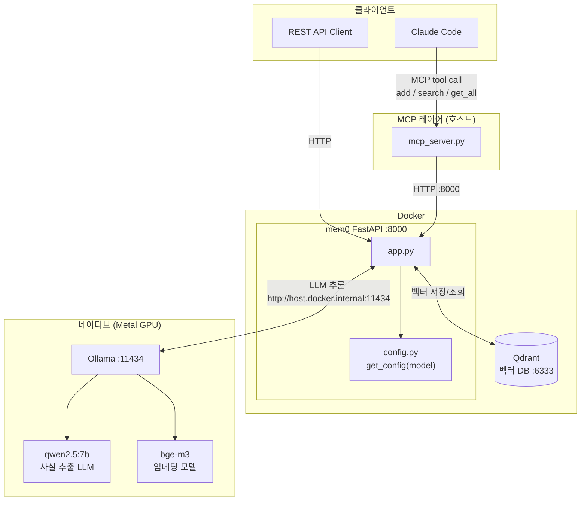
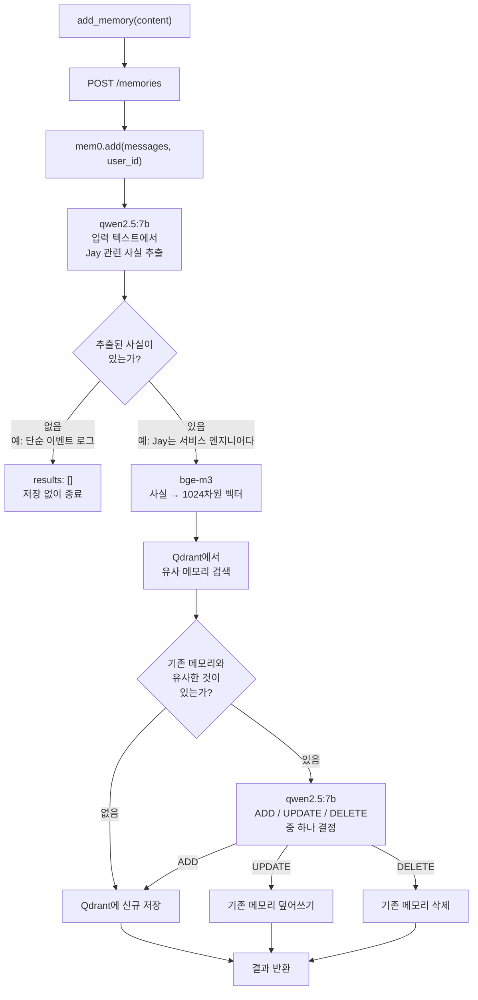
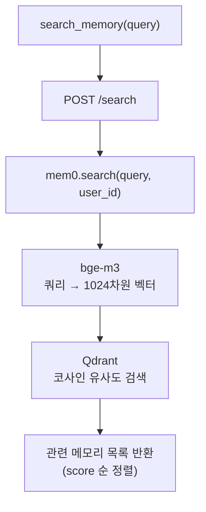
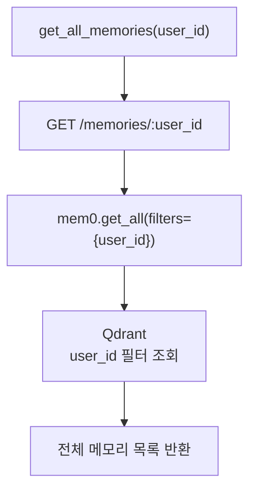

# 시스템 동작 흐름

## 전체 아키텍처

```mermaid
flowchart TD
    subgraph Client["클라이언트"]
        A["Claude Code"]
        B["REST API Client"]
    end

    subgraph MCP["MCP 레이어 (호스트)"]
        C["mcp_server.py"]
    end

    subgraph Docker["Docker"]
        subgraph API["mem0 FastAPI :8000"]
            D["app.py"]
            E["config.py\nget_config(model)"]
        end
        F[("Qdrant\n벡터 DB :6333")]
    end

    subgraph Native["네이티브 (Metal GPU)"]
        G["Ollama :11434"]
        G1["qwen2.5:7b\n사실 추출 LLM"]
        G2["bge-m3\n임베딩 모델"]
        G --> G1
        G --> G2
    end

    A -->|"MCP tool call\nadd / search / get_all"| C
    B -->|"HTTP"| D
    C -->|"HTTP :8000"| D
    D --> E
    D <-->|"벡터 저장/조회"| F
    D <-->|"LLM 추론 http://host.docker.internal:11434"| G
```

---

## add_memory 흐름

```mermaid
flowchart TD
    A["add_memory(content)"] --> B["POST /memories"]
    B --> C["mem0.add(messages, user_id)"]

    C --> D["qwen2.5:7b\n입력 텍스트에서\nJay 관련 사실 추출"]

    D --> E{추출된 사실이\n있는가?}

    E -->|"없음\n예: 단순 이벤트 로그"| F["results: []\n저장 없이 종료"]

    E -->|"있음\n예: Jay는 서비스 엔지니어다"| G["bge-m3\n사실 → 1024차원 벡터"]

    G --> H["Qdrant에서\n유사 메모리 검색"]

    H --> I{기존 메모리와\n유사한 것이\n있는가?}

    I -->|"없음"| J["Qdrant에 신규 저장"]
    I -->|"있음"| K["qwen2.5:7b\nADD / UPDATE / DELETE\n중 하나 결정"]

    K -->|"ADD"| J
    K -->|"UPDATE"| L["기존 메모리 덮어쓰기"]
    K -->|"DELETE"| M["기존 메모리 삭제"]

    J --> N["결과 반환"]
    L --> N
    M --> N
```

---

## search_memory 흐름

```mermaid
flowchart TD
    A["search_memory(query)"] --> B["POST /search"]
    B --> C["mem0.search(query, user_id)"]

    C --> D["bge-m3\n쿼리 → 1024차원 벡터"]
    D --> E["Qdrant\n코사인 유사도 검색"]
    E --> F["관련 메모리 목록 반환\n(score 순 정렬)"]
```

---

## get_all_memories 흐름

```mermaid
flowchart TD
    A["get_all_memories(user_id)"] --> B["GET /memories/:user_id"]
    B --> C["mem0.get_all(filters={user_id})"]
    C --> D["Qdrant\nuser_id 필터 조회"]
    D --> E["전체 메모리 목록 반환"]
```
